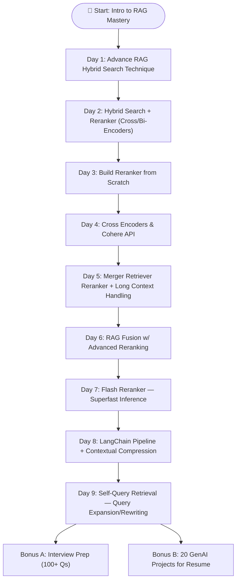

    


# 🎯 RAG Session — **ADV RAG Mastery: ALL RAG Retrieval & Reranking Technique (OneShort Playlist)**

> I created a dedicated new Playlist **RAG Session — ADV RAG Mastery: ALL RAG Retrieval & Reranking Technique (OneShort)**.  
> This repository contains the day-wise sessions, hands-on labs, deliverables and resources for a practical masterclass on advanced Retrieval-Augmented Generation (RAG) and reranking techniques.

---

## 🔎 Quick overview
This playlist/course is built to teach engineers, ML researchers and applied-NLP practitioners how to design, implement, evaluate and deploy advanced retrieval + reranking systems that work with modern LLMs. The focus is practical: pipelines, indexing, ANN, hybrid search, cross-encoders, rerankers, contextual compression, long-context strategies, and production considerations (latency, cost, evaluation).

**Recommended format:** 9 main classroom-style sessions (one per folder/topic below) plus two bonus sessions for interview prep & project ideas. Each main session has lecture topics, hands-on lab, exercises and evaluation targets.

---

## 📂 Folders (mapped to sessions)
1. Advance RAG Hybrid Search Technique  
2. Advance RAG with Hybrid Search ReReranker in …  
3. Advance RAG Reranking from Scratch  
4. Reranking With Cross Encoders, and Cohere API  
5. Merger Retriever Reranker LongConte…  
6. RAG Fussion With Reranking Adv RAG Technique  
7. Flash reranker For Superfast Reranking ADV RAG Technique  
8. Powerful RAG With Langchain Contextual Compression …  
9. Self Query Retrieval ADV RAG

---

## 🗓 Day-wise sessions — in depth & full details

> **Format per day:** Lecture (30–45m) → Live coding / Lab (60–90m) → Exercises & evaluation (30–45m).  
> **Prerequisites:** Python, basic ML/NLP, familiarity with transformers, basic retrieval (BM25, embeddings), git, basic Docker.

---

### Day 1 — **Advance RAG Hybrid Search Technique**
**Goal:** Understand and implement hybrid search that combines sparse (BM25) + dense (embedding) retrieval and fuse scores for high recall and precision.

**Prerequisites:** Python, faiss/hnswlib basics, sklearn, transformers.

**Lecture outline**
- Why hybrid search? strengths/weakness trade-offs.
- Sparse methods (BM25) — tokenization, idf, scoring.
- Dense methods — sentence/embedding models (SBERT, OpenAI embeddings, Cohere).
- Index choices — FAISS, HNSW, Milvus; sharding and memory tradeoffs.
- Score fusion strategies: linear interpolation, learned combiner, reciprocal rank fusion (RRF).
- Handling query / doc preprocessing: normalization, stopwords, stemming, n-grams.

**Hands-on lab**
- Build BM25 retriever (Whoosh or rank_bm25).
- Build dense embedding retriever (SentenceTransformers → FAISS/HNSW).
- Implement fusion: weighted sum + RRF; test retrieval on a small dataset.
- Evaluate: Recall@K, Precision@K, nDCG.

**Deliverable**
- Notebook: `day1_hybrid_search.ipynb` with code, experiments and evaluation plots.

---

### Day 2 — **Advance RAG with Hybrid Search ReReranker**
**Goal:** Add a reranking layer to the hybrid pipeline to boost final ranking quality.

**Lecture outline**
- Reranker roles and when to apply them.
- Bi-encoder (fast retrieval) vs cross-encoder (expensive but accurate).
- Data for reranker: annotation, weak supervision, harvested positives/negatives.
- Negative sampling strategies (random, hard negatives from ANN).
- Distillation / teacher-student approach for speed.

**Lab**
- Use hybrid retriever from Day 1 to collect candidate sets.
- Implement a cross-encoder reranker (use Hugging Face `cross-encoder/ms-marco-MiniLM-L-` style model or fine-tune a small BERT).
- Train with pairwise loss (MarginRankingLoss) and evaluate on held-out queries.

**Exercises**
- Create a script to automatically mine hard negatives.
- Compare latency vs accuracy tradeoffs.

---

### Day 3 — **Advance RAG Reranking from Scratch**
**Goal:** Build and train a reranker from raw data; cover full pipeline from data prep to deployment.

**Lecture outline**
- Dataset creation: query-document pairs, labeling strategies (manual, heuristic).
- Architectures: cross-encoder vs interaction-focused models vs modular reranker.
- Training strategies: pairwise vs pointwise vs listwise.
- Evaluation metrics: MRR, MAP, nDCG, Recall@K, latency profiling.

**Lab**
- Write data engineering scripts to generate pairwise training examples.
- Train a cross-encoder on small dataset; log metrics with wandb or simple CSV.
- Export model and integrate it into the hybrid pipeline.

**Deliverable**
- `day3_reranker_from_scratch/` with training scripts, model checkpoint and evaluation report.

---

### Day 4 — **Reranking With Cross Encoders, and Cohere API**
**Goal:** Learn how to use cross-encoder rerankers in practice and integrate third-party APIs (Cohere) for embeddings or reranking features.

**Lecture outline**
- Cross-encoder architecture details and speed optimizations (batching, truncation, mixed precision).
- Using managed embedding APIs (OpenAI / Cohere) vs local models: costs, control, privacy.
- Practical integration patterns: prefetch embeddings, async pipelines, caching.

**Lab**
- Integrate Cohere (or mock if you don’t have keys) to get embeddings + similarity baseline.
- Compare a local cross-encoder (hf) vs an API-based approach for ranking quality and cost/time.
- Implement a small caching layer to reduce API calls.

**Deliverable**
- `day4_cohere_cross_encoder_demo.ipynb` + cost/latency analysis.

---

### Day 5 — **Merger Retriever Reranker — Long Contexts & Aggregation**
**Goal:** Combine multiple retrievers and handle very long documents / long-context retrieval strategies.

**Lecture outline**
- Multi-retriever designs: specialist retrievers (FAQ, code, long text) + meta-retriever.
- Long-context problems: chunking, hierarchical retrieval, overlap windows.
- Merge strategies: late fusion vs early fusion, union of candidates, deduplication.
- Context selection heuristics for LLM prompts.

**Lab**
- Build a pipeline that queries multiple retrievers (BM25 + dense + semantic code retriever).
- Implement chunking + sliding window for long documents and aggregate candidate chunks.
- Show how to produce a "merged" input for the LLM that respects token limits.

**Exercises**
- Build a debug tool to visualize which retriever contributed which candidate.

---

### Day 6 — **RAG Fusion With Reranking — Advanced Techniques**
**Goal:** Deep dive into fusion techniques (fusion-in-decoder, late fusion), retrieval for generation and reranking outputs.

**Lecture outline**
- Fusion-in-Decoder (FiD) overview and when to use it.
- Re-ranking generated outputs vs re-ranking retrieved inputs.
- Controlling hallucinations: passage-level attribution and provenance tracking.
- Combining retrieval scores with generation confidence.

**Lab**
- Implement a simple FiD-like pipeline using retrieved contexts and an open-source LLM wrapper (or simulated).
- Add a reranker to re-score generated candidate answers using provenance matches (score by overlap, evidence).
- Implement plain provenance highlighting.

**Deliverable**
- `day6_rag_fusion_rerank_demo.md` with code samples.

---

### Day 7 — **Flash Reranker — Superfast Reranking for Production**
**Goal:** Techniques to make reranking ultra-fast and production-ready.

**Lecture outline**
- Distillation and tiny cross-encoders: how to train a small model that approximates bigger rerankers.
- Quantization, ONNX, and model optimization for CPU inference.
- Approximate re-ranking: lightweight scoring heuristics, cascade re-ranking (fast → slow).
- Deployment patterns for low-latency systems (gRPC, batching, autoscaling).

**Lab**
- Distill a big cross-encoder into a small model; benchmark speed/accuracy.
- Export model to ONNX and run inference.
- Implement cascade: top-500 → fast scorer → top-50 → heavy cross-encoder.

**Exercises**
- Measure average RPS and p95 latency on local machine; suggest autoscaling rules.

---

### Day 8 — **Powerful RAG With LangChain & Contextual Compression**
**Goal:** Use LangChain (or similar frameworks) to build modular RAG pipelines and apply contextual compression to reduce token usage.

**Lecture outline**
- LangChain retriever/compressor components: retrievers, chain-of-thought, document-compressors.
- Contextual compression: summarize or compress documents before sending to the LLM.
- When to compress: cost vs signal retention.
- Plugging rerankers and compressors into chain flows.

**Lab**
- Build a LangChain pipeline: retriever → compressor (summarizer) → reranker → LLM.
- Compare sending raw chunks vs compressed summaries into the generator: measure quality + cost.

**Deliverable**
- `day8_langchain_contextual_compression_notebook.ipynb`.

---

### Day 9 — **Self-Query Retrieval — Advanced Query Rewriting & LLM-driven Retrieval**
**Goal:** Use LLMs to generate better retrieval queries (self-query) and integrate query rewriting / expansion into the pipeline.

**Lecture outline**
- Self-query techniques: prompt an LLM to generate targeted queries for retrieval (e.g., using query templates).
- Query reformulation: canonicalization, entity extraction, question decomposition.
- LLM-assisted negative mining, query expansion with synonyms/concepts.
- Guardrails and prompt safety for automated query generation.

**Lab**
- Implement a self-query module that: (1) uses LLM to rephrase user question into search queries; (2) runs hybrid retrieval; (3) aggregates candidates.
- Evaluate the impact of self-query on Recall@K and final answer quality.

**Deliverable**
- `day9_self_query_retrieval.ipynb` with examples and experiments.

---

## 🔁 Bonus sessions
**Bonus A — Interview Prep (data from your PDFs)**  
- Use `100 GenAI Interview Questions`, `100+ Generative AI Interview Question And Easy Answer`, `GEN AI interview` to create flashcards, mock interviews and quick-turn answers.

**Bonus B — 20 GenAI Projects For Your Resume (Project ideas + scaffolds)**  
- Turn project ideas into 2–4 week mini-project plans with dataset links, evaluation metrics, and PoC checklists.

---

## 📄 Supplementary files (attached / recommended)
- `100 GenAI Interview Questions SunnySavita` — PDF (use to create interview flashcards and sample questions).
- `100+ Generative AI Interview Question And Easy Answer` — Word doc (copy into `docs/` and convert to markdown).
- `GEN AI interview` — PDF (additional interview prep).
- `20 GenAI Projects For Your Resume` — PDF (project ideas to implement as course capstones).

> Put these files in a `resources/` folder and link them in each day's README as optional reading.

---


---

## ✅ How to add this README to GitHub (quick commands)
1. Create repo on GitHub (e.g., `RAG-ADV-Mastery`) or locally:
```bash
git init
git add README.md
git commit -m "chore: https://github.com/abhishekkumar62000/ADV-RAG-Mastery-ALL-RAG-Retrieval-Reranking-Technique-OneShort"
git branch -M main
git remote add origin git@github.com:<https://github.com/abhishekkumar62000/ADV-RAG-Mastery-ALL-RAG-Retrieval-Reranking-Technique-OneShort.git
git push -u origin main

---


---

# 🌐 LangGraph Workflow — ADV RAG Mastery (Day-wise Sessions)



---

## 🧩 Node → Edge Explanation (Day-wise Dependencies)

* **Day 1 → Day 2**: You must understand hybrid retrieval before adding rerankers.
* **Day 2 → Day 3**: After learning rerankers, you build one **from scratch**.
* **Day 3 → Day 4**: Extend to **cross encoders & Cohere API** for managed solutions.
* **Day 4 → Day 5**: Use **multi-retrievers & long context strategies**.
* **Day 5 → Day 6**: Fusion strategies build on multi-retriever pipelines.
* **Day 6 → Day 7**: Move to **production-grade speed optimization** (Flash Reranker).
* **Day 7 → Day 8**: Integrate into frameworks (**LangChain**) and add contextual compression.
* **Day 8 → Day 9**: Once pipelines are mature, add **self-query LLM-driven retrieval**.
* **Day 9 → Bonus**: By now you can prepare for interviews and implement portfolio projects.

---

## ⚙️ Workflow in LangGraph Terms

* **Nodes** = Day/session modules (D1 → D9 + Bonus).
* **Edges** = Directed dependencies (`edge: from → to`).
* **Execution flow** = linear, but allows branch at **Day 9 → Bonus A & Bonus B**.
* **Optional parallel edges**: Some labs (Day 4 Cohere API & Day 5 Merger Retriever) can run in parallel after Day 3.

---

---

## 👨‍💻 Developer Information  

**Created by Abhishek Yadav**  
📧 **Email:** abhiydv23096@gmail.com  
🔗 **LinkedIn:** [Abhi Yadav](https://www.linkedin.com/in/your-linkedin-profile)  
🐙 **GitHub Profile:** [@abhishekkumar62000](https://github.com/abhishekkumar62000)  

📸 **Developer Profile Image:**  

<p align="center">
  

      
</p>


---

🔥 *This repository + video series is your one-stop place for mastering **ADV RAG & MultiModel RAG LLM RAG Pineline Mastery***.

---


